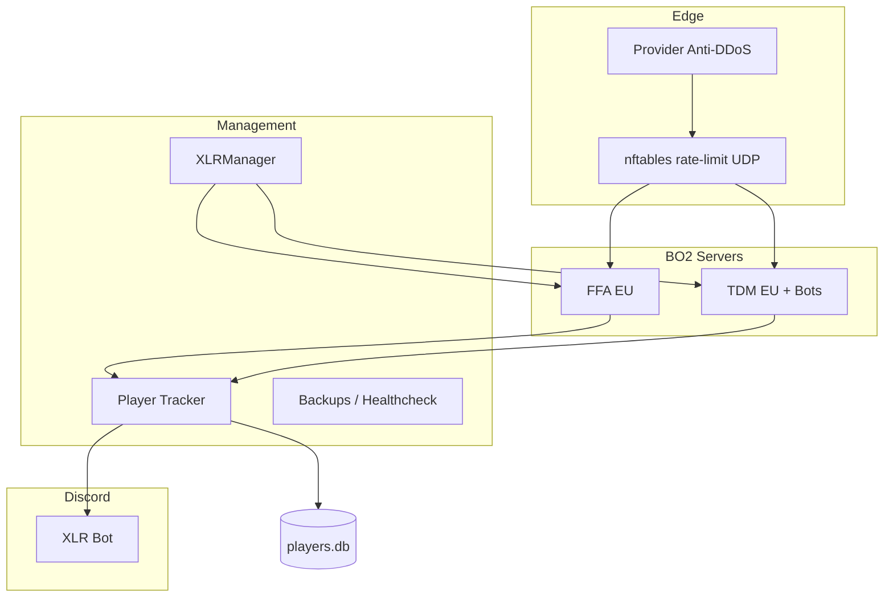

<div align="center">


# XLR Project

**The solution to unplayable servers: stable, secured and protected.**
Fast EU Black Ops II servers on Plutonium T6 — enjoy the nostalgia without thinking about anything.


**[Join the community »](https://discord.gg/63FAj2ZMrN)**

</div>

---

## About

**XLR Project** is a full platform built on top of [Plutonium T6](https://plutonium.pw/) to run high-quality European Black Ops II servers. It is not a stock installer — it adds network-level DDoS hardening, a player database, in-game welcome messages and tips, filler bots, and a complete Discord bot to run the community and the infrastructure from one place.

XLR is built and maintained by **akan3** as a long-term home for BO2 players who want servers that are fast, fair, and actually protected.

> This project is a heavily customized fork of [Sterbweise/T6Server](https://github.com/Sterbweise/T6Server). The base installer (Wine, firewall, game binaries) comes from that project; the entire **XLR layer** (security, customization, player tracking, Discord bot, bots) is specific to this repository.

> ⚠️ During installation, game binaries are downloaded through the historical Plutonium T6 torrent method. For legal reasons Plutonium cannot support this publicly. If you prefer to provide your own legally obtained game files, use `import-game-files.sh` and see `Resources/binaries/MANUAL_UPLOAD.txt`.

---

## Table of Contents

- [Features](#features)
- [Architecture](#architecture)
- [Requirements](#requirements)
- [Installation](#installation)
- [Configuration](#configuration)
- [Managing the servers](#managing-the-servers)
- [Discord bot](#discord-bot)
- [In-game experience](#in-game-experience)
- [Filler bots (Bot Warfare)](#filler-bots-bot-warfare)
- [Updating](#updating)
- [Directory structure](#directory-structure)
- [Troubleshooting](#troubleshooting)
- [Credits](#credits)
- [License](#license)
- [Support](#support)

---

## Features

### Infrastructure & security
- **Anti-DDoS hardening** — nftables per-IP UDP rate limiting, anti-spoof sysctl tuning, kernel network buffers
- **Plutonium anti-cheat** — `sv_securityLevel` and `sv_anticheat` enforced at launch
- **IP ban system** — bans applied both in the database and at the nftables level
- **Automated backups**, scheduled restarts on idle, and health monitoring via systemd timers
- Secrets (Discord token, owner ID, webhook) kept out of git in `/etc/xlr/secrets.env`

### Servers
- **Multi-server manager** (`XLRManager.sh`) — FFA and TDM EU by default, Gun Game / Zombies optional
- Per-server CPU and memory limits, auto-restart on crash or empty server
- Custom hostnames, MOTD, and map rotation

### In-game (GSC)
- Welcome message on spawn (screen + chat)
- Owner join announcement (screen + chat)
- Rotating tips in chat (Discord invite, report reminder, unique-player counter, …)

### Player data
- SQLite database tracking, per connection: names history, Plutonium ID, Steam ID, all IPs
- Unique-player counter per server, since launch
- In-game `!report` piped straight to Discord

### Discord bot
- Live server status, player counts and network stats (`!status`, `!stats`, `!players`)
- Game moderation from Discord (`!gameban`, `!gameunban`, `!report`, `!lookup`)
- In-game ban announcement + auto-kick on the affected server
- Full community bot: moderation, anti-nuke, tickets, captcha, welcome, fun & mini-games
- Branded XLR embeds (`#00A2FF`), paginated help that only shows commands you can run

### Filler bots
- [Bot Warfare](https://github.com/ineedbots/t6_bot_warfare) integration for TDM
- Bots use **real player names pulled from the database** (owner excluded) with an `[XLR]` clan tag
- Configurable fill count, max difficulty, auto-kick a bot when a real player joins

---

## Architecture



---

## Requirements

| | |
|---|---|
| **OS** | Debian 10 / 11 / 12 or Ubuntu 22.04 / 24.04 (64-bit) |
| **Arch** | x86_64 (AMD64) |
| **RAM** | 2 GB minimum; 4 GB+ recommended for FFA + TDM + bots |
| **Disk** | ~15 GB free |
| **Access** | root / sudo |
| **Other** | `git`, stable connection, a [Plutonium server key](https://platform.plutonium.pw/serverkeys) per server |

---

## Installation

```bash
# 1. Clone
cd /opt
git clone https://github.com/kyrazzx/XLRProject.git
cd XLRProject

# 2. Run the installer
chmod +x install.sh
sudo ./install.sh
```

The installer walks you through language selection, firewall, .NET (for IW4MAdmin), Wine, game binaries, and then deploys the full XLR stack (security, customization, bots, systemd services).

---

## Configuration

The single source of truth is **`Plutonium/server_config.json`**.

Key sections:

| Section | Purpose |
|---------|---------|
| `security_hardening` | Anti-DDoS / anti-spoof / rate-limit tuning |
| `customization` | Discord invite, welcome text, MOTD, tips interval, owner info |
| `bot_warfare` | Filler bot settings (enabled, servers, fill, skill, clan tag) |
| `moderation` | Player DB path, in-game report command |
| `discord_config` | Bot enable flag, channel IDs, guild ID |
| `servers` | Per-server ports, gametype, keys, resource limits |

**Set your Plutonium key** — replace every `YOURKEY` (`key` and `rcon_password`) in `server_config.json`.

**Secrets** (never committed) live in `/etc/xlr/secrets.env`:

```env
DISCORD_TOKEN=your_bot_token
DISCORD_OWNER_ID=your_discord_user_id
DISCORD_WEBHOOK=optional_webhook_url
```

```bash
sudo chmod 600 /etc/xlr/secrets.env
```

To regenerate configs interactively at any time:

```bash
sudo ./xlr-configure.sh
```

---

## Managing the servers

`XLRManager.sh` controls every enabled server at once, or one by id (`ffa`, `tdm`, `all`).

```bash
cd Plutonium

sudo ./XLRManager.sh start all      # start every enabled server
sudo ./XLRManager.sh restart tdm    # restart only TDM
sudo ./XLRManager.sh stop all
sudo ./XLRManager.sh status         # live status table
sudo ./XLRManager.sh backup         # run a backup now
```

systemd services installed by XLR:

| Service | Role |
|---------|------|
| `xlr-manager.service` | Starts servers + monitoring + auto-restart |
| `xlr-player-tracker.service` | Player DB, in-game reports, bot-name sync, ban enforcement |
| `xlr-discord-bot.service` | The XLR Discord bot |

---

## Discord bot

Enable it in `server_config.json` (`discord_config.enabled = true`), set the token in secrets, then:

```bash
sudo systemctl enable --now xlr-discord-bot.service
```

### BO2 server commands

| Command | Access | Action |
|---------|--------|--------|
| `!status` | Everyone | Live status of all servers |
| `!stats` | Everyone | Online players, unique players, active bans |
| `!players [ffa\|tdm]` | Everyone | Player count per server |
| `!report <player> <reason>` | Everyone | Submit a report |
| `!gameban <player\|id\|ip> <reason>` | Admin | Ban from BO2 servers (DB + nftables) + in-game announce & kick |
| `!gameunban <player\|id\|ip>` | Admin | Remove a game ban |
| `!lookup <name\|id\|ip>` | Bot owner | Player record (names, IDs, IPs) |
| `!forcetip [ffa\|tdm\|all]` | Bot owner | Push a random in-game tip immediately |
| `!restart [ffa\|tdm\|all]` | Admin | Restart game servers |
| `!dismiss <id>` | Admin | Dismiss a pending report |

Beyond BO2, the bot ships full community tooling: moderation, anti-nuke (`!secur-on`, `!antibot`, …), tickets, captcha, welcome messages, utility, fun and Discord mini-games. Run `!help` for the paginated, permission-aware list.

---

## In-game experience

Handled by the compiled GSC script `Resources/gsc/mp/xlr_welcome.gsc`, deployed and compiled automatically on update:

- **On spawn** — a screen banner + welcome and report reminder in chat
- **Owner join** — announced to everyone (screen + chat)
- **Rotating tips** — sent in chat on an interval (`customization.auto_message_interval_seconds`), including a live unique-player counter

All in-game text is English and fully editable from the config / GSC source.

---

## Filler bots (Bot Warfare)

XLR integrates [ineedbots/t6_bot_warfare](https://github.com/ineedbots/t6_bot_warfare) to keep TDM populated.

- Configured under `bot_warfare` in `server_config.json` (TDM only by default)
- **Max difficulty**, fills up to a configurable total (default **12**), leaving slots free for real players
- A bot is auto-kicked when a real player connects
- Bot names are pulled at random from the player database (owner excluded) and tagged **`[XLR]`**, refreshed every few minutes by the player tracker into `Plutonium/storage/t6/bots.txt`

Deploy or refresh manually:

```bash
sudo bash .config/xlr/setupBotWarfare.sh --install
sudo bash Plutonium/XLRManager.sh restart tdm
```

---

## Updating

```bash
cd ~/XLRProject
git pull
./xlr-update.sh
sudo systemctl restart xlr-player-tracker.service xlr-discord-bot.service
sudo bash Plutonium/XLRManager.sh restart all
```

`xlr-update.sh` re-applies customization, recompiles the GSC, refreshes Bot Warfare and re-applies security. Use `--full-configure` to also regenerate the `dedicated_*.cfg` from templates (destructive).

---

## Directory structure

```
XLRProject/
├── .config/
│   ├── security/setupDdosProtection.sh   # anti-DDoS
│   └── xlr/                              # XLR install modules
│       ├── setupCustomization.sh        # GSC deploy + MOTD + tips dvars
│       ├── setupBotWarfare.sh           # Bot Warfare install + dvars
│       └── setupSystemd.sh              # systemd units
├── Plutonium/
│   ├── XLRManager.sh                    # multi-server manager
│   └── server_config.json              # main configuration
├── Resources/
│   ├── gsc/mp/xlr_welcome.gsc          # in-game script (welcome, tips)
│   └── xlr/                            # Python: bot, tracker, library
│       ├── xlr_bot.py / xlr_lib.py     # Discord bot + shared library
│       ├── player_tracker.py           # DB tracking, reports, ban enforcement
│       ├── sync_bot_names.py           # bots.txt generator
│       ├── cogs/                       # Discord command modules
│       └── assets/xlr_logo.png
├── install.sh / uninstall.sh
├── xlr-configure.sh / xlr-update.sh
```

---

## Troubleshooting

**Server not in the Plutonium list** — use a valid, unique server key per server and confirm the game UDP port is open.

**Discord bot won't start** — check the token in `/etc/xlr/secrets.env` and `discord_config.enabled`, then inspect logs: `journalctl -u xlr-discord-bot.service -n 50`.

**No in-game tips** — ensure the GSC compiled: `cat Plutonium/storage/t6/scripts/mp/xlr_welcome.compile.log`, then restart the game server.

**Bots not spawning on TDM** — verify `bots_manage_fill` in `Server/Multiplayer/main/dedicated_tdm.cfg` and that Bot Warfare scripts exist in `Plutonium/storage/t6/scripts/mp/`.

For Wine display errors: they are harmless and can be ignored.

---

## Credits

- [Plutonium](https://plutonium.pw) — the T6 client and server platform
- [Sterbweise/T6Server](https://github.com/Sterbweise/T6Server) — the base installer this project forks
- [ineedbots/t6_bot_warfare](https://github.com/ineedbots/t6_bot_warfare) — filler bots
- [IW4MAdmin](https://github.com/RaidMax/IW4M-Admin) — optional web admin
- [plutonium-updater](https://github.com/mxve/plutonium-updater.rs) — server updater

---

## License

Licensed under the **GPL-3.0** License — see [LICENCE](LICENCE).

---

## Support

**Discord:** [discord.gg/63FAj2ZMrN](https://discord.gg/63FAj2ZMrN)

Open an issue on this repository for bugs or feature requests.

<div align="center">

**Play EU. Play protected. Play XLR.**

</div>
